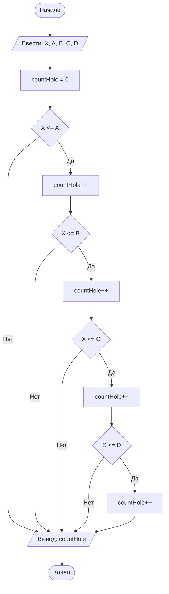

## Отчет по лабораторной работе № 1

#### № группы: `ПМ-2602`

#### Выполнила: `Галкина Ксения Евгеньевна`

#### Вариант: `3`


### Cодержание:

- [Постановка задачи](#1-постановка-задачи)
- [Входные и выходные данные](#2-входные-и-выходные-данные)
- [Выбор структуры данных](#3-выбор-структуры-данных)
- [Алгоритм](#4-алгоритм)
- [Программа](#5-программа)
- [Анализ правильности решения](#6-анализ-правильности-решения)

### 1. Постановка задачи

> Шарик диаметром X пытаются протащить через последовательность отверстий диаметрами A, B, C, D. Через какое количество отверстий удастся протащить шарик? На вход программы подаются натуральные числа X, A, B, C, D.

Данную задачу можно разделить на 2 подзадачи: проверка условий проходимости для каждого отверстия и подсчёт количества успешных проходов.

Важно: отверстия образуют последовательность, поэтому шарик проходит через них по порядку. Если шарик не проходит через очередное отверстие, то дальнейшие отверстия не рассматриваются, так как до них он не доберётся.

- Для каждого отверстия проверяется условие:
      `X <= A`
      `X <= B`
      `X <= C`
      `X <= D`
- Если условие выполняется, счётчик увеличивается на 1 и проверяется следующее отверстие.
- Если условие не выполняется, проверка прекращается, и на экран выводится текущее значение счётчика.

Всего надо рассмотреть `4` условия, но они проверяются последовательно.

### 2. Входные и выходные данные

#### Данные на вход

На вход программа должна получать 5 чисел, при этом в условии сказано, что числа натуральные, поэтому нижней границей будет 1, а верхней укажем 2**31 - 1 (максимально возможное значением для типа `int`). Не будем брать тип `long`, т.к. суть задачи приближена к действительности, поэтому не имеет смысла рассматривать значения, превышающие 2<sup>31</sup> - 1.

|                   | Тип                | min значение | max значение   |
|-------------------|--------------------|--------------|----------------|
| X (Диаметр шара)  | Натуральное число  | 1            |2<sup>31</sup> - 1|
| A (Отверстие 1)   | Натуральное число  | 1            |2<sup>31</sup> - 1|
| B (Отверстие 2)   | Натуральное число  | 1            |2<sup>31</sup> - 1|
| C (Отверстие 3)   | Натуральное число  | 1            |2<sup>31</sup> - 1|
| D (Отверстие 4)   | Натуральное число  | 1            |2<sup>31</sup> - 1|

#### Данные на выход

Т.к. программа должна вывести количество отверстий, через которые удастся протащить шарик, то на выход мы получим единственное целое неотрицательное число, не превышающее 4.

|                        | Тип                | min значение | max значение |
|------------------------|--------------------|--------------|--------------|
| Количество отверстий   | Целое число        | 0            | 4            |

### 3. Выбор структуры данных

Программа получает 5 натуральных чисел. Поэтому для их хранения можно выделить 5 переменных (`X`, `A`, `B`, `C`, `D`) типа `int`.

|                   | название переменной | Тип (в Java) | 
|-------------------|---------------------|--------------|
| X (Диаметр шара)  | `X`                 | `int`        |
| A (Отверстие 1)   | `A`                 | `int`        |
| B (Отверстие 2)   | `B`                 | `int`        |
| C (Отверстие 3)   | `C`                 | `int`        |
| D (Отверстие 4)   | `D`                 | `int`        |

Для подсчёта количества подходящих отверстий используется переменная `countHole` типа `byte`.

|                        | название переменной | Тип (в Java) | 
|------------------------|---------------------|--------------|
| Количество отверстий   | `countHole`         | `byte`       |

### 4. Алгоритм

#### Алгоритм выполнения программы:

1. **Ввод данных:**  
   Программа считывает пять натуральных чисел, обозначенные как `X`, `A`, `B`, `C`, `D`.

2. **Инициализация счётчика:**  
   Переменная `countHole` инициализируется нулем.

3. **Последовательная проверка условий:**
   - Проверяется условие `X <= A`. Если оно истинно, `countHole` увеличивается на 1, иначе программа переходит к выводу результата.
   - Если предыдущее условие истинно, проверяется `X <= B`. Если оно истинно, `countHole` увеличивается на 1, иначе программа переходит к выводу результата.
   - Если предыдущее условие истинно, проверяется `X <= C`. Если оно истинно, `countHole` увеличивается на 1, иначе программа переходит к выводу результата.
   - Если предыдущее условие истинно, проверяется `X <= D`. Если оно истинно, `countHole` увеличивается на 1.

4. **Вывод результата:**  
   На экран выводится значение переменной `countHole`.

#### Блок-схема



### 5. Программа

```java
import java.io.PrintStream;
import java.util.Scanner;

public class lab1 {
    // Объявляем объект класса Scanner для ввода данных
    public static Scanner in = new Scanner(System.in);
    // Объявляем объект класса PrintStream для вывода данных
    public static PrintStream out = System.out;

    public static void main(String[] args) {
        // Считывание 5 натуральных чисел из консоли
        int X = in.nextInt();
        int A = in.nextInt();
        int B = in.nextInt();
        int C = in.nextInt();
        int D = in.nextInt();

        byte countHole = 0; // инициализация счетчика подходящих отверстий

        if (X <= A) {
            countHole += 1; // если (X <= A), то countHole++.
            // Если же нет, то далее условия проверяться не будут,
            // счетчик выведет 0.
            if (X <= B) {
                countHole += 1; // если (X <= B), то countHole++.
                // Если же нет, то далее условия проверяться не будут,
                // счетчик выведет 1.
                if (X <= C) {
                    countHole += 1; // если (X <= C), то countHole++.
                    // Если же нет, то далее условия проверяться не будут,
                    // счетчик выведет 2.
                    if (X <= D) {
                        countHole += 1; // если (X <= D), то countHole++.
                        // Если же нет, то далее условия проверяться не будут,
                        // счетчик выведет 3.
                    }
                }
            }
        }

        out.print(countHole); // вывод результата (количества отверстий,
                              // через которые прошел шар)
    }
}
```

### 6. Анализ правильности решения

Программа работает корректно на всем множестве решений с учетом ограничений.

1. Тест на все подходящие отверстия:

    - **Input**:
        ```
        1 2 3 4 5
        ```

    - **Output**:
        ```
        4
        ```

2. Тест на отсутствие подходящих отверстий:

    - **Input**:
        ```
        10 1 2 3 4
        ```

    - **Output**:
        ```
        0
        ```

3. Тест на остановку после второго отверстия:

    - **Input**:
        ```
        5 5 4 6 5
        ```

    - **Output**:
        ```
        1
        ```

4. Тест на остановку после третьего отверстия:

    - **Input**:
        ```
        3 4 5 2 6
        ```

    - **Output**:
        ```
        2
        ```

5. Тест на равенство диаметров:

    - **Input**:
        ```
        7 7 7 7 7
        ```

    - **Output**:
        ```
        4
        ```
6. Тест на остановку после 1 отверстия:

    - **Input**:
        ```
        4 7 1 8 6
        ```

    - **Output**:
        ```
        1
        ```
