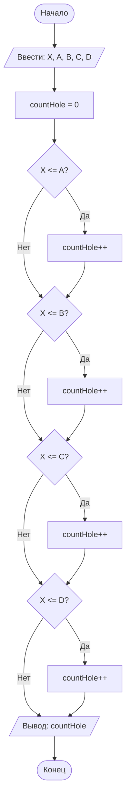

## Отчет по лабораторной работе № 1

#### № группы: `ПМ-2602`

#### Выполнил: `Галкина Ксения Евгеньевна`

#### Вариант: `3`

### Cодержание:

- [Постановка задачи](#1-постановка-задачи)
- [Входные и выходные данные](#2-входные-и-выходные-данные)
- [Выбор структуры данных](#3-выбор-структуры-данных)
- [Алгоритм](#4-алгоритм)
- [Программа](#5-программа)
- [Анализ правильности решения](#6-анализ-правильности-решения)

### 1. Постановка задачи

> Шарик диаметром X пытаются протащить через последовательность отверстий диаметрами A, B, C, D. Через какое количество отверстий удастся протащить шарик? На вход программы подаются натуральные числа X, A, B, C, D.

Данную задачу можно разделить на 2 подзадачи: проверка условия для каждого отверстия и подсчет количества успешных проходов.

- Для 1 подзадачи нужно рассмотреть условия для каждого отверстия:
    `X <= A`
    `X <= B`
    `X <= C`
    `X <= D`
- Если условие выполняется, значит шарик проходит через отверстие, тогда счетчик увеличивается на 1.

### 2. Входные и выходные данные

#### Данные на вход

На вход программа должна получать 5 чисел, при этом в условии сказано, что числа натуральные, поэтому будем считать их целыми положительными. 
Также определим верхнюю и нижнюю границы получаемых чисел. (у натуральных числе нет макс. значения).

|                   | Тип                | min значение | max значение   |
|-------------------|--------------------|--------------|----------------|
| X (Диаметр шара)  | Натуральное число  | 1            |-               |
| A (Отверстие 1)   | Натуральное число  | 1            |-               |
| B (Отверстие 2)   | Натуральное число  | 1            |-               |
| C (Отверстие 3)   | Натуральное число  | 1            |-               |
| D (Отверстие 4)   | Натуральное число  | 1            |-               |

#### Данные на выход

Т.к. программа должна вывести количество отверстий, через которые удастся протащить шарик, то на выход мы получим единственное целое неотрицательное число, не превышающее 4.

|                        | Тип                | min значение | max значение |
|------------------------|--------------------|--------------|--------------|
| Количество отверстий   | Целое число        | 0            | 4            |

### 3. Выбор структуры данных

Программа получает 5 натуральных чисел. Поэтому для их хранения можно выделить 5 переменных (`X`, `A`, `B`, `C`, `D`) типа `int`.

|                   | название переменной | Тип (в Java) | 
|-------------------|---------------------|--------------|
| X (Диаметр шара)  | `X`                 | `int`        |
| A (Отверстие 1)   | `A`                 | `int`        |
| B (Отверстие 2)   | `B`                 | `int`        |
| C (Отверстие 3)   | `C`                 | `int`        |
| D (Отверстие 4)   | `D`                 | `int`        |

Для подсчета количества подходящих отверстий используется переменная `countHole` типа `int`.

|                        | название переменной | Тип (в Java) | 
|------------------------|---------------------|--------------|
|Y (Количество отверстий)| `countHole`         | `int`        |

### 4. Алгоритм

#### Алгоритм выполнения программы:

1. **Ввод данных:**  
   Программа считывает пять натуральных чисел, обозначенные как `X`, `A`, `B`, `C`, `D`.

2. **Инициализация счетчика:**  
   Переменная `countHole` создается со значением равным нулю.

3. **Проверка условий:**
   - Проверяется условие `X <= A`. Если оно истинно, `countHole` увеличивается на 1.
   - Проверяется условие `X <= B`. Если оно истинно, `countHole` увеличивается на 1.
   - Проверяется условие `X <= C`. Если оно истинно, `countHole` увеличивается на 1.
   - Проверяется условие `X <= D`. Если оно истинно, `countHole` увеличивается на 1.

4. **Вывод результата:**  
   На экран выводится значение переменной `countHole`.

#### Блок-схема



### 5. Программа

```java
import java.io.PrintStream;
import java.util.Scanner;

public class lab1 {
    // Объявляем объект класса Scanner для ввода данных
    public static Scanner in = new Scanner(System.in);
    // Объявляем объект класса PrintStream для вывода данных
    public static PrintStream out = System.out;

    public static void main(String[] args) {
        // Считывание 5 натуральных чисел из консоли
        int X = in.nextInt();
        int A = in.nextInt();
        int B = in.nextInt();
        int C = in.nextInt();
        int D = in.nextInt();
        
        int countHole = 0; // инициализация счетчика подходящих отверстий
        
        // Определение количества подходящих отверстий
        if (X <= A) {
            countHole += 1; // если X<=A, то countHole++
        }
        if (X <= B) {
            countHole += 1; // если X<=B, то countHole++
        }
        if (X <= C) {
            countHole += 1; // если X<=C, то countHole++
        }
        if (X <= D) {
            countHole += 1; // если X<=D, то countHole++
        }
        
        out.print(countHole); // вывод результата(количества отверстий, через которые прошел шар)
    }
}
```

### 6. Анализ правильности решения

Программа работает корректно на всем множестве решений с учетом ограничений.

1. Тест на все подходящие отверстия:

    - **Input**:
        ```
        1 2 3 4 5
        ```

    - **Output**:
        ```
        4
        ```

2. Тест на отсутствие подходящих отверстий:

    - **Input**:
        ```
        10 1 2 3 4
        ```

    - **Output**:
        ```
        0
        ```

3. Тест на частичное совпадение:

    - **Input**:
        ```
        5 5 4 6 5
        ```

    - **Output**:
        ```
        3
        ```

4. Тест на равенство диаметров:

    - **Input**:
        ```
        7 7 7 7 7
        ```

    - **Output**:
        ```
        4
        ```
